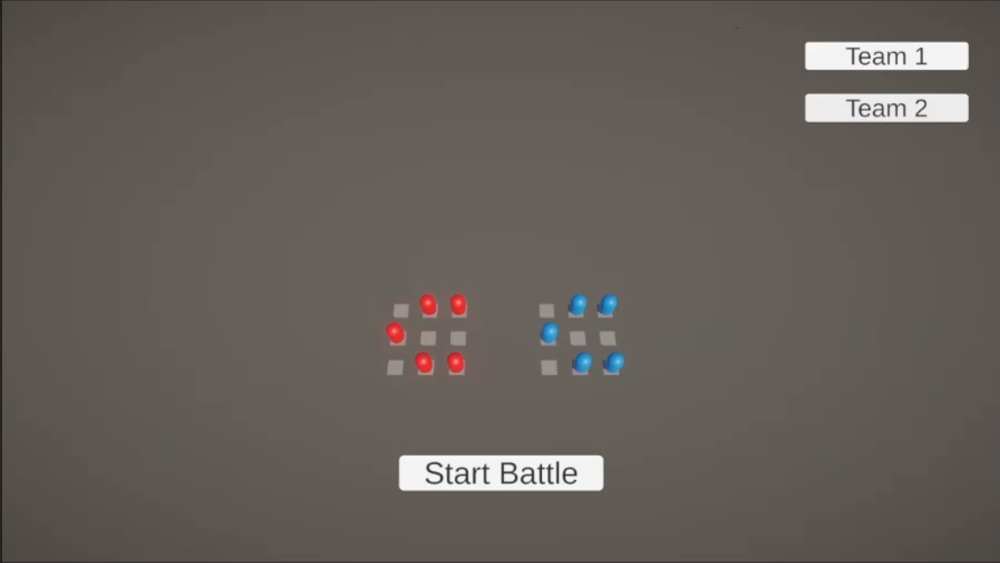

<!-- PROJECT LOGO -->

<h3>   Battle Simulator

   
<a href="https://www.youtube.com/watch?v=E1-fTTuxCIU">Game Overview</a> 
    <a href="https://www.youtube.com/watch?v=WN8-BFGJ8NA">How to create Lineups</a>  </h3>   
   
 
   
 

   

## Overview
This strategy game was developed for my Steer Elite Internship application. Each match features a procedurally generated Red Team, challenging the player to build a countering Blue Team from a roster of units. Built with the ECS pattern, the game emphasizes modularity, scalability, and performance to meet modern development standards.

## Project Info
**Role:** Solo Developer 
 
**Duration:** 2 week
 
**Tech:** Unity Ecs, C#  

> [!NOTE]
> Unity Version: 6000.0.2f1
> ECS Version: 1.2.1

